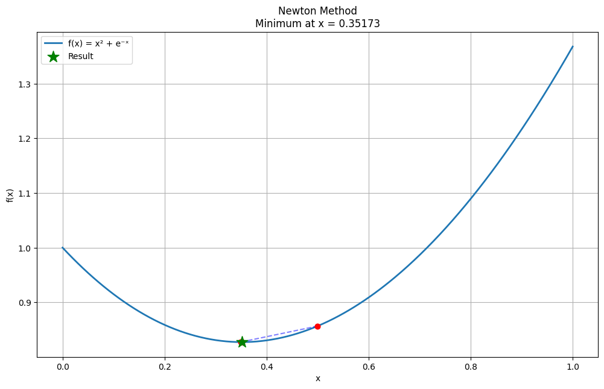
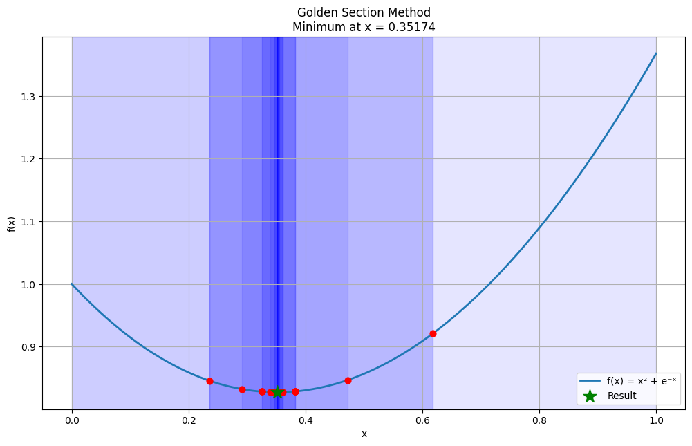

# Метопы лаба 2

$$
f(x) = x^2 + e^{-x}, [a, b] = [0, 1], \epsilon = 0.003
$$

Найти экстремумы с помощью: метод половинного деления, метод золотого сечения, метод хорд, метод Ньютона

Первые пять пунктов каждого метода выполнить письменно

